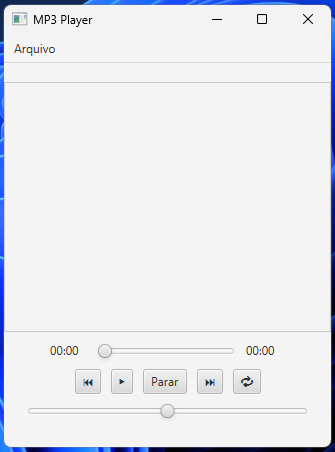

# MP3 Player JavaFX

Um player de música desenvolvido em **Java + JavaFX**, com uma interface simples inspirada em players de música modernos.

O projeto permite carregar arquivos MP3, criar uma playlist e controlar a reprodução das músicas.

## Demostração



## Sobre o projeto

O MP3 Player possui uma interface limpa com:

- Lista de músicas com scroll
- Controle de reprodução
- Barra de progresso
- Controle de volume
- Loop de música
- Remover músicas da playlist
- Reprodução automática da primeira música

## Tecnologias utilizadas

- Java 17
- JavaFX 21
- Maven

## Funcionalidades

### Playlist

- Adicionar músicas MP3
- Visualizar músicas adicionadas
- Remover músicas da lista

### Áudio

- Controle de volume
- Barra de progresso
- Exibição do tempo atual e duração da música

## Como executar

### Tenha instalado

- Java JDK 17+
- Maven

1. Clone esse repositorio:

```bash
git clone https://github.com/estudos-ryan/MP3Player.git
```

1. Execute no terminal:

```bash
mvn javafx:run
```

## Estrutura do Arquivos

- **`Main.java`**
  - *Ponto de entrada:* Responsável apenas por instanciar e inicializar a aplicação.

- **`App.java`**
  - *Interface Gráfica:* Contém os componentes visuais e a interação com o usuário.

- **`MusicPlayer.java`**
  - *Lógica de Áudio:* Gerencia os controles de áudio (tocar, pausar, parar e nível de volume).

- **`Playlist.java`**
  - *Gerenciador de Mídias:* Cuida do gerenciamento, ordenação e navegação da lista de músicas.

## Melhorias futuras

- Modo aleatório
- Mostrar capa do álbum
- Suporte a mais formatos de áudio
